# Phase 1 — Plan Step Completion Enforcement

## Overview

Two governance gaps discovered during Phase 1 development, resolved by moving
enforcement out of git and into the AI workflow layer:

1. **Stale step tables** — plan tasks were marked ✅ Complete while step rows
   still showed ⏳ Pending. AI memory is not enforcement; governed tool paths are.

2. **Complete button not blocked** — the PropertiesPane "Complete" button was
   available even when steps were pending. Fixed in UI; and now also enforced
   at the point of any AI write attempt.

The solution: all AI plan mutations route through MCP tools. The PreToolUse hook
blocks direct file writes entirely. Git pre-commit (`.githooks/pre-commit`) retains
pending-step validation via `lifecycle-gate.js --check-files` as a commit-time
backstop, plus git-native checks (commit format, file placement, required fields).

See [[docs/ai-governance-enforcement.md]] and
[[policies/core/workflow-layer-governance.md]] for the full architecture.

## Implementation Steps

| # | Deliverable | Details | Status |
|---|-------------|---------|--------|
| 1 | UI: Complete button disabled when steps pending | `$derived.by` counts pending markers in Implementation Steps; button shows count and tooltip | ✅ Done |
| 2 | `hasPendingStepsInSection()` + `checkPendingSteps()` in `lifecycle-gate.js` | State-machine parser; `validateFile()` calls it; `--check-files` flag for batch use | ✅ Done |
| 3 | PreToolUse hook blocks ALL direct writes/edits to `plans/*.md` | `claude-lifecycle-hook.sh` — blanket Write + Edit block; redirects to MCP tools | ✅ Done |
| 4 | Plan template: reminder note | "When marking a task ✅ Complete, update every step row" above Implementation Steps | ✅ Done |
| 5 | Tests: `test/hooks/test-pending-steps.js` | 12 cases — 8 unit (`hasPendingStepsInSection`) + 4 file-based (`checkPendingSteps`) | ✅ Done |
| 6 | MCP `_has_pending_steps()` in `transition_to_completed` | Safety-net validation; blocks archival if pending rows remain | ✅ Done |
| 7 | MCP plan mutation tools | `update_step`, `update_plan_status`, `append_history`, `set_plan_field`, `write_plan` + all helpers | ✅ Done |
| 8 | AGENTS.md Invariant 6 | Names the five MCP tools; proactive self-check contract | ✅ Done |
| 9 | Core policy: `policies/core/workflow-layer-governance.md` | Why git is wrong layer; four enforcement surfaces; ships to adopters | ✅ Done |
| 10 | Reference doc: `docs/ai-governance-enforcement.md` | Tool table, layer descriptions; links governance_enforcement_layers.svg | ✅ Done |
| 11 | CLAUDE.md + README.md + `policies/core/code-over-memory.md` updated | Philosophy entry, governance architecture section, mechanism table corrected | ✅ Done |
| 12 | Plan-completion skill — `docs/SOPs/plan-completion.md` | Explicit 5-step routine with MCP tool sequence; closes behavioral gap at Layer 1 | ✅ Done |

## Design Decisions

- **State-machine parser** — tracks section context before flagging ⏳ in table rows;
  ~30 lines, no deps. Eliminates false positives from ⏳ in prose. Lives in
  `lifecycle-gate.js` (JS, tests) and ported inline to `mcp-server.py` (Python).
- **Targeted MCP tools over full content replacement** — each tool mutates only
  the specific string it owns; everything else on disk is guaranteed unchanged.
  Prevents content drift when AI rewrites large files.
- **PreToolUse as AI write gate** — fires before Write/Edit executes, before any
  file is touched. Blanket block on `plans/*.md` with redirect message.
- **MCP as governed path** — recounts `total_steps`/`completed_steps` and logs
  to audit trail on every call. No `--no-verify` escape hatch.
- **Git pre-commit as final backstop** — `.githooks/pre-commit` calls
  `lifecycle-gate.js --check-files` on staged plans (pending-step validation)
  AND handles git-native concerns (commit format, file placement, required fields,
  no template vars). This was already implemented; discovered mid-session. The MCP
  and PreToolUse layers prevent bad state from ever reaching a commit; git is the
  last catch for anything that slips through.
- **UI regex false-positive risk** — UI uses regex, not the state-machine parser;
  ⏳ inside a code block in Implementation Steps would fire falsely. Accepted as
  Phase 1 known limitation; fix in Phase 2 when dispatch linter is wired up.

## Phase Gate

**Reviewer:** NetYeti (solo Phase 1 — `/critique-plan` adversarial review substitutes for human independence)
**Status:** `pending`

- [x] All deliverables ✅ Done
- [x] `node test/hooks/test-pending-steps.js` → 12/12 pass
- [x] PreToolUse hook blocks direct Write/Edit to any `plans/*.md`
- [x] MCP `update_plan_status(..., 'completed')` rejects plan with ⏳ rows
- [x] MCP `transition_to_completed` rejects plan with ⏳ rows
- [x] Complete button disabled when plan has ⏳ steps
- [x] Core policy and reference doc written and committed
- [x] Plan-completion skill written (`docs/SOPs/plan-completion.md`)
- [x] All design decisions documented
- [ ] `tests_defined: true` set after human review of Tests section

## Tests

> `tests_defined` must be set to `true` by the human reviewer after confirming
> the tests below adequately cover the requirements.

| # | Test | Verifies | How to run | Expected result |
|---|------|----------|-----------|-----------------|
| 1 | 8 unit tests | `hasPendingStepsInSection()` — all section/scope cases | `node test/hooks/test-pending-steps.js` | 12/12 pass |
| 2 | 4 file-based tests | `checkPendingSteps()` reads real temp files; ok:false when ⏳ present | `node test/hooks/test-pending-steps.js` | Tests 9-12 pass |
| 3 | Hook blocks direct Edit to plan | `claude-lifecycle-hook.sh` returns stop-reason for any Edit on `plans/*.md` | Claude Code session: attempt any Edit to a plan file | Hook blocks; redirect message shown |
| 4 | Hook blocks direct Write to plan | `claude-lifecycle-hook.sh` returns stop-reason for any Write to `plans/*.md` | Claude Code session: attempt any Write to a plan file | Hook blocks; redirect message shown |
| 5 | MCP `update_plan_status` rejects pending | Blocks `completed` when ⏳ rows remain | Call `update_plan_status('x', 'completed')` on plan with ⏳ rows | Returns error; no file mutation |
| 6 | MCP `update_step` updates and recounts | Replaces status cell; updates `total_steps`/`completed_steps` | Call `update_step` on a known step; read back file | Step updated; counts correct in frontmatter |
| 7 | MCP `append_history` adds row | Appends row with today's date and resolved author | Call `append_history('x', 'test change')` | Row appears at bottom of Document History table |
| 8 | UI Complete button disabled | PropertiesPane disables button when plan has ⏳ in Implementation Steps | Open plan with ⏳ steps; inspect Complete button | Disabled with count tooltip |

## Document History

| Date | Change | Author |
|------|--------|--------|
| 2026-06-04 | Created — promoted to Phase 1; UI enforcement already shipped | NetYeti |
| 2026-06-04 | Simplified — removed verbose Critical Review; corrected Deliverable 3 (hook not wired); fixed gate checklist state | NetYeti |
| 2026-06-04 | Deliverable 3 redesigned — enforcement moved from git pre-commit to Claude Code PreToolUse hook + MCP safety net | NetYeti |
| 2026-06-04 | Expanded scope — hook upgraded to blanket plan write block; five MCP mutation tools added; policy and reference docs written | NetYeti |
| 2026-06-04 | Correction — discovered `.githooks/pre-commit` already calls `lifecycle-gate.js --check-files`; Design Decisions and Overview updated to reflect actual architecture | NetYeti |
| 2026-06-04 | Deliverable 12 — plan-completion skill; fixes wrong MCP tool names in opencode-instructions.md | NetYeti |
